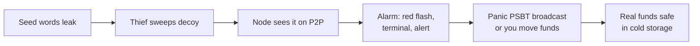

# Virtual Node — Project Phase Plan

Sep 24, 2026 · @neal sampat

## Overview

Virtual Node is a trustless Bitcoin server on the ThinkPad (btcserver) that Sparrow connects to, watched through the synthwave dashboard. The next build is real xpub wallets, then the Canary Seed, then everything else in order of how much it protects your coins.

Every phase follows the same rules:

- **Tor or nothing.** All traffic goes over Tor, and the node stops rather than falling back to clearnet.
- **Verify, don't trust.** Anything from an explorer is checked against the node's own proof-of-work header chain before it's used. Anything that can't be proven is labelled as trusted.
- **Keys stay off the node.** The node watches xpubs and broadcasts transactions you've already signed; it never holds private keys or passphrases.
- **Ship small, test first.** Each phase is tested end to end against real Sparrow on a simulated network before it reaches the ThinkPad.

## Built so far

Phases 1 and 2 are live on the ThinkPad at 192.168.86.34:9000. The Wallets (Option 1 xpub import), UTXOs and Build TX tabs still show mock data.

| Phase | Area | What's live |
| --- | --- | --- |
| 1 | Tor transport | Every connection goes over Tor with remote DNS and a separate circuit per connection. Fails closed when Tor is down, and the exit is verified. |
| 1 | Pleb Node Network | 10 real P2P peers, mostly onion, with trust scoring, lag and ping checks, no two peers from the same network block, rotation every 10 min, and a Refresh Peers button for a full fresh reconnect. |
| 1 | Header chain | Sparrow's 478 checkpoints plus full difficulty rules. Syncs from P2P and bans peers that send bad headers. |
| 1 | Explorer cross-check | Blockstream onion Esplora supplies tip, fees and mempool size (mempool.space removed). |
| 2 | Sparrow private server | Electrum protocol on TCP 50001 and SSL 50002, home network only. Every tx is re-hashed and every merkle proof checked against your headers. Tested with real Sparrow 2.5.5. |
| 2 | Node Terminal | Matrix decrypt effect, all P2P traffic in and out, green/red scanline flash on deposits and withdrawals, a bitcoin news feed (new items only, all caps) and 978 numbered wisdom quotes that never repeat within a cycle. |
| 2 | Extras | Music and Synthwave players, live BTC price over Tor, and footer links to monetarynode.org and the ⚡ support address. |

## Next phases

Phase 3 (real xpub wallets) comes first because the Canary Seed and everything after it watch wallets by xpub.

| Phase | Name | What it delivers | Done when |
| --- | --- | --- | --- |
| 3 | Real xpub wallets | Paste an xpub/ypub/zpub. The node derives receive and change addresses (gap limit 20), looks them up over Tor in parallel batches, and verifies every tx against your headers. The Wallets, UTXOs and balance card become real, and xpub wallets get the deposit/withdrawal flash. | A real xpub shows the same UTXOs and balance as Sparrow, and the mock data is gone. |
| 4 | Lookup bar | Paste a block height or hash, a txid or an address. Blocks come straight from archival P2P peers; txids and addresses come from the explorer and are then proven. Each answer carries a badge: *proven by your headers* or *explorer says*. | Every result shows how it was verified. |
| 5 | Canary Seed | Watch a decoy wallet (seed words, no passphrase) that holds a small bait balance, while the real funds sit behind a BIP39 passphrase. If the decoy moves, raise an alarm and optionally broadcast a panic sweep you signed in advance. Details below. | A test spend of the decoy triggers the alarm within one P2P relay, and the pre-signed sweep broadcasts. |
| 6 | Broadcast privacy + Double-Spend Radar | Stealth broadcast: one random onion peer first, the rest after a random delay, each on its own circuit, with optional scheduled delays. All 10 peers watch incoming payments for RBF or double-spends until they confirm, with an amber flash on conflict. | A test double-spend of an incoming payment is caught before it confirms. |

### Phase 5 in detail: Canary Seed

The decoy wallet and the real wallet share the same 12 or 24 words. The words alone open the decoy; the words plus your passphrase open the real wallet. A thief who finds or photographs the words sees a plausible wallet, sweeps it, and never learns the passphrase exists.

The node only ever holds the decoy's xpub, so the passphrase never touches the ThinkPad. The optional panic sweep is a PSBT you sign in Sparrow ahead of time, moving the real wallet to cold storage. It has to be re-signed whenever the real wallet's coins change, and the dashboard warns when it goes stale. Keep the bait small but believable, so the thief takes it rather than looking further.

### Red Alert: Emergency Mode (ships with Phase 5, reused by Phase 8)

Any emergency trigger (the Canary Seed decoy moving, a Cinderella sweep failing, a Vault clawback) puts the whole dashboard into Emergency Mode until you shut it off.

| While the emergency is active | When you press EMERGENCY SHUT-OFF |
| --- | --- |
| Every other line in the Node Terminal is a **bold red, all-caps** notice saying what set off the alarm and what to do about it (see below) (e.g. `⚠ EMERGENCY: CANARY SEED DECOY SWEPT — MOVE PASSPHRASE FUNDS NOW`). | Notices stop; the terminal returns to normal. |
| Wisdom quotes are paused. | Wisdom resumes where the cycle left off (no quotes skipped or repeated). |
| The page background flashes red. | Background returns to the synthwave grid. |
| Synthwave (and Music) playback stops. | Players stay off; you can turn them back on yourself. |
| An **EMERGENCY SHUT-OFF** button appears next to the Node Terminal, pulsing red. | The button hides until the next emergency. |

The emergency state lives on the node, not in the browser, so every open dashboard shows it, and a page reload or server restart doesn't clear it. The shut-off only silences the alarm: it doesn't cancel a panic sweep that has already been broadcast, and the event stays in the Audit Logs. A new, different emergency re-arms the alarm even after a shut-off.

#### What the alert says

Every alert names its trigger with the evidence, then gives advice. The notice lines rotate: one **WHAT HAPPENED** line with the txid, amount, time and which peer relayed it, then the numbered **DO THIS NOW** steps one per notice, then back to the start. The same text appears in a pinned box above the terminal, the Audit Logs and any phone alert.

| Trigger | What happened (example) | Advice shown |
| --- | --- | --- |
| Canary Seed tripped | `CANARY SEED TRIPPED: DECOY WALLET SPENT 0.00210000 BTC IN TX 3F9A… AT 02:14, RELAYED BY NODE_07. YOUR SEED WORDS ARE COMPROMISED.` | 1. Assume the thief has your 12/24 words; the passphrase is your only protection now. 2. Move the passphrase wallet to a brand-new seed (not the same words with a new passphrase). 3. If a panic PSBT was armed, check it confirmed. 4. Find the leak: where were the words stored or photographed? |
| Panic sweep status | `PANIC SWEEP BROADCAST: 0.84 BTC → COLD STORAGE, TX 7C21…, WAITING FOR 1ST CONFIRMATION.` | 1. Don't touch the swept wallet. 2. Watch for confirmation; bump the fee if it's stuck over an hour. 3. If the sweep was rejected (stale PSBT), move the funds by hand now. |
| Vault clawback | `UNVAULT YOU DIDN'T START: VAULT 1 SPEND OF 0.50 BTC SEEN IN TX 91BE… → CLAWBACK TO COLD BROADCAST.` | 1. Your vault's hot key is compromised; don't reuse it. 2. Let the clawback confirm; don't cancel it. 3. Re-create the vault with new keys before depositing again. |
| Pumpkin TX failed | `CINDERELLA SWEEP FAILED: PUMPKIN TX FOR HOT WALLET REJECTED (COINS ALREADY MOVED OR PSBT STALE).` | 1. Your hot funds are unprotected. 2. Check whether the coins moved on purpose. 3. Re-sign a fresh Pumpkin TX or move the funds to cold by hand. |

Advice is fixed per trigger and written in plain words. The node never asks for seed words or a passphrase, and an alert that does is not from Virtual Node.

### Yellow Alert: an automatic transaction ran

A Yellow Alert means something you set up did its job on its own, such as a dead man's switch firing or a transaction triggered by an OP\_RETURN marker. Nothing is under attack, but money moved without you pressing a button, so you should know.

|  | Yellow Alert | Red Alert |
| --- | --- | --- |
| Means | An automatic transaction you armed has executed or is about to | Theft, compromise or a failed protection |
| Background | Yellow | Flashing red |
| Music and Synthwave | Off | Off |
| Button by the terminal | **YELLOW ALERT** lights up; press to acknowledge | **EMERGENCY SHUT-OFF** pulses red |
| Pinned pane at the top of the terminal | Stays until you close it with its ×, even after you press the button | Stays until shut-off |
| Terminal notices | A yellow alert line with the explanation every \~5 seconds | Every other line, bold red all caps |
| Pressing the button | Background, button and repeating lines return to normal; the pane stays until closed | Everything returns to normal |

If a Red Alert fires during a Yellow Alert, red takes over. When red is shut off, the yellow alert comes back if you haven't acknowledged it yet. Both are kept on the node, so reloads and restarts don't clear them, and both go in the Audit Logs.

| Trigger | Terminal line (example) | Explanation shown |
| --- | --- | --- |
| OP\_RETURN trigger | `YELLOW ALERT: OP_RETURN MARKER "VN-RELEASE-01" SEEN IN TX 5B3E… → PRE-SIGNED TX 0.25 BTC BROADCAST, TX C8F1…` | Bitcoin can't run code from an OP\_RETURN, so the node watches for your marker and then broadcasts the transaction you pre-signed. Check the payment reached the right address; if the marker wasn't yours, re-arm with a new marker. |
| Dead man's switch due | `YELLOW ALERT: DEAD MAN'S SWITCH — NO CHECK-IN FOR 358 DAYS. HEIR TRANSFER RUNS IN 7 DAYS.` | Check in from the dashboard to reset the timer. If you can't, the transfer runs on schedule. |
| Dead man's switch fired | `YELLOW ALERT: DEAD MAN'S SWITCH FIRED — 1.20 BTC SENT TO HEIR ADDRESS, TX 44D0…` | The transfer ran as designed and can't be pulled back. If it was a mistake, contact your heir; re-arm with a new schedule if needed. |
| Cinderella sweep ran | `YELLOW ALERT: MIDNIGHT — PUMPKIN TX SWEPT 0.05 BTC FROM HOT WALLET TO COLD, TX 2A7D…` | The 24 hours passed unused, so the funds went home as planned. Re-fund the hot wallet if you still need it. |

### Phone alerts via ntfy (self-hosted on Umbrel)

Every alert is also pushed to your phone through your own [ntfy](https://apps.umbrel.com/app/ntfy) server on Umbrel. It's free, open source and has no third-party account; the node publishes to it over your home network, so alerts never touch the internet on the way out.

| Event | ntfy priority | Phone behaviour |
| --- | --- | --- |
| Red Alert | 5 (max) | Long vibration bursts and a pop-over. ntfy doesn't repeat by itself, so the node re-sends every 30 s until you acknowledge, for up to 3 h. |
| Yellow Alert | 4 (high) | One alert with a longer vibration |
| Deposit or withdrawal | 3 (default), optional | Normal notification |
| Tor down, peers lost, node offline | 3 (default) | Normal notification |

- **Acknowledge button.** Each red alert carries an ntfy action button that tells the node you've seen it. The node then stops re-sending and logs `ACKNOWLEDGED ON PHONE AT 02:16`, but the dashboard alarm stays on until you press the shut-off. Pressing EMERGENCY SHUT-OFF on the dashboard also stops the phone re-sends.
- **Locked down.** Access control is deny-all by default: the node gets a publish-only token, your phone a read-only one, and the topic name is long and random. Messages are cached on the Umbrel only briefly.
- **Away from home.** Your phone has to reach the Umbrel to receive alerts. On home Wi-Fi that's automatic; away from home it needs a private tunnel such as Tailscale or WireGuard, or alerts wait until you're back in range. On iPhone, instant delivery also sends a content-free wake-up signal through ntfy.sh; the message itself is fetched from your Umbrel.
- **Setup.** The Umbrel address, topic and tokens are kept only on the ThinkPad as settings, never shown in the dashboard. A **Send test alert** button checks the whole path. If the Umbrel is unreachable, the node shows it on the dashboard and in the terminal.
- **Messages.** The phone gets the same WHAT HAPPENED line and advice as the dashboard, with a 🚨 or ⚠️ tag so red and yellow are easy to tell apart on the lock screen.

## Later phases

Phases 7 to 10 build on the xpub wallets and the broadcast machinery. The receipt work from the original Phase 7 and 7.6 keeps its scope, and adds offline PGP signing.

| Phase | Name | What it delivers |
| --- | --- | --- |
| 7 | Self-verifying receipts | A receipt (file or QR) that bundles the tx, its merkle proof and the block headers, so anyone can verify it offline without trusting you or an explorer. Signed with RSA-4096 as approved, **plus PGP keys offline** (the node prepares the receipt, you sign on an air-gapped machine). Optional OP\_RETURN anchoring. |
| 7.6 | Receipt verifier | Paste or upload a receipt; it checks the signature (RSA or PGP), the merkle proof and the headers' proof-of-work. |
| 8 | Timelock wallets | **Cinderella Wallet:** a hot wallet whose funds are swept home by a pre-signed, 24-hour timelocked "Pumpkin TX" unless they're spent first. **Vault + Clawback:** two-step spends with a \~144-block delay, where the node broadcasts a pre-signed clawback to cold storage if a spend you didn't start appears. Optional yearly dead man's switch to an heir. |
| 9 | Trustless UTXOs | Compact block filters (BIP157/158) from pleb nodes that serve them, cross-checked across peers. The node derives your UTXOs from verified blocks, so no explorer ever sees your addresses. |
| 10 | Network intelligence | Soft Fork Radar (upgrade signalling from your own headers), Core vs Knots meter, Who Mined It (pool tags from coinbase txs, 50% warning), Eclipse Alarm (statistically slow blocks trigger an automatic fresh reconnect), difficulty and halving predictor. |

Also queued, unscheduled: dashboard access from anywhere through a private onion address (Tor Browser, client-auth key), a second onion explorer to split address lookups, a one-line installer, and an optional Bitcoin Core + Fulcrum mode for full local verification.

## Parked ideas and open decisions

**Dropped:**

- **Canary Coin.** A thief with the hot wallet's keys sweeps the canary and everything else in one transaction, which turns the alarm into a fee war you lose. Replaced by the Canary Seed (Phase 5) and Vault + Clawback (Phase 8).
- **Querying UTXOs from P2P peers.** `getutxos` (BIP64) was never implemented in Bitcoin Core, so peers can't answer UTXO questions. Phase 3 uses the explorer plus proofs; Phase 9 removes the explorer.
- **Many-API consensus (Blockcypher, Blockchain.com, Blockchair).** Replaced by P2P headers plus one onion explorer whose answers are proven, which is stronger than majority voting and keeps everything on Tor.
- **mempool.space.** Removed at your request; Blockstream's onion explorer now covers it.

**Open decisions:**

- [x] Canary Seed alerts: decided on self-hosted ntfy on Umbrel (see Phone alerts via ntfy). Still open: Tailscale or WireGuard for alerts away from home?
- [ ] Panic sweep: broadcast automatically the moment the decoy moves, or wait for your one-tap confirmation?
- [ ] Receipts: keep RSA-4096 alongside PGP, or go PGP-only for simplicity?
- [ ] Earlier whitelist and policy presets (strict mode, daily limits): fold into Phase 6, or park until multisig and hardware wallet support?
