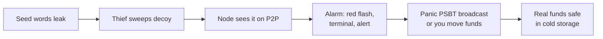

# Virtual Node — Project Phase Plan

Sep 24, 2026 · @neal sampat

## Overview

Virtual Node is a trustless Bitcoin server on the ThinkPad (btcserver) that Sparrow connects to, watched through the synthwave dashboard. The next build is real xpub wallets, then the Canary Seed, then everything else in order of how much it protects your coins.

Every phase follows the same rules:

- **Tor or nothing.** All traffic goes over Tor, and the node stops rather than falling back to clearnet.
- **Verify, don't trust.** Anything from an explorer is checked against the node's own proof-of-work header chain before it's used. Anything that can't be proven is labelled as trusted.
- **Keys stay off the node.** The node watches xpubs and broadcasts transactions you've already signed; it never holds private keys or passphrases.
- **Ship small, test first.** Each phase is tested end to end against real Sparrow on a simulated network before it reaches the ThinkPad.

## Built so far

Phases 1 and 2 are live on the ThinkPad at 192.168.86.34:9000. The Wallets (Option 1 xpub import), UTXOs and Build TX tabs still show mock data.

| Phase | Area | What's live |
| --- | --- | --- |
| 1 | Tor transport | Every connection goes over Tor with remote DNS and a separate circuit per connection. Fails closed when Tor is down, and the exit is verified. |
| 1 | Pleb Node Network | 10 real P2P peers, mostly onion, with trust scoring, lag and ping checks, no two peers from the same network block, rotation every 10 min, and a Refresh Peers button for a full fresh reconnect. |
| 1 | Header chain | Sparrow's 478 checkpoints plus full difficulty rules. Syncs from P2P and bans peers that send bad headers. |
| 1 | Explorer cross-check | Blockstream onion Esplora supplies tip, fees and mempool size (mempool.space removed). |
| 2 | Sparrow private server | Electrum protocol on TCP 50001 and SSL 50002, home network only. Every tx is re-hashed and every merkle proof checked against your headers. Tested with real Sparrow 2.5.5. |
| 2 | Node Terminal | Matrix decrypt effect, all P2P traffic in and out, green/red scanline flash on deposits and withdrawals, a bitcoin news feed (new items only, all caps) and 978 numbered wisdom quotes that never repeat within a cycle. |
| 2 | Extras | Music and Synthwave players, live BTC price over Tor, and footer links to monetarynode.org and the ⚡ support address. |

## Next phases

Phase 3 (real xpub wallets) comes first because the Canary Seed and everything after it watch wallets by xpub.

| Phase | Name | What it delivers | Done when |
| --- | --- | --- | --- |
| 3 | Real xpub wallets | Paste an xpub/ypub/zpub. The node derives receive and change addresses (gap limit 20), looks them up over Tor in parallel batches, and verifies every tx against your headers. The Wallets, UTXOs and balance card become real, and xpub wallets get the deposit/withdrawal flash. | A real xpub shows the same UTXOs and balance as Sparrow, and the mock data is gone. |
| 4 | Lookup bar | Paste a block height or hash, a txid or an address. Blocks come straight from archival P2P peers; txids and addresses come from the explorer and are then proven. Each answer carries a badge: *proven by your headers* or *explorer says*. | Every result shows how it was verified. |
| 5 | Canary Seed | Watch a decoy wallet (seed words, no passphrase) that holds a small bait balance, while the real funds sit behind a BIP39 passphrase. If the decoy moves, raise an alarm and optionally broadcast a panic sweep you signed in advance. Details below. | A test spend of the decoy triggers the alarm within one P2P relay, and the pre-signed sweep broadcasts. |
| 6 | Broadcast privacy + Double-Spend Radar | Stealth broadcast: one random onion peer first, the rest after a random delay, each on its own circuit, with optional scheduled delays. All 10 peers watch incoming payments for RBF or double-spends until they confirm, with an amber flash on conflict. | A test double-spend of an incoming payment is caught before it confirms. |

### Phase 5 in detail: Canary Seed

The decoy wallet and the real wallet share the same 12 or 24 words. The words alone open the decoy; the words plus your passphrase open the real wallet. A thief who finds or photographs the words sees a plausible wallet, sweeps it, and never learns the passphrase exists.

The node only ever holds the decoy's xpub, so the passphrase never touches the ThinkPad. The optional panic sweep is a PSBT you sign in Sparrow ahead of time, moving the real wallet to cold storage. It has to be re-signed whenever the real wallet's coins change, and the dashboard warns when it goes stale. Keep the bait small but believable, so the thief takes it rather than looking further.

### Emergency Mode (ships with Phase 5, reused by Phase 8)

Any emergency trigger (the Canary Seed decoy moving, a dead man's switch or Cinderella sweep firing, a Vault clawback) puts the whole dashboard into Emergency Mode until you shut it off.

| While the emergency is active | When you press EMERGENCY SHUT-OFF |
| --- | --- |
| Every other line in the Node Terminal is a **bold red, all-caps** notice naming the emergency (e.g. `⚠ EMERGENCY: CANARY SEED DECOY SWEPT — MOVE PASSPHRASE FUNDS NOW`). | Notices stop; the terminal returns to normal. |
| Wisdom quotes are paused. | Wisdom resumes where the cycle left off (no quotes skipped or repeated). |
| The page background flashes red. | Background returns to the synthwave grid. |
| Synthwave (and Music) playback stops. | Players stay off; you can turn them back on yourself. |
| An **EMERGENCY SHUT-OFF** button appears next to the Node Terminal, pulsing red. | The button hides until the next emergency. |

The emergency state lives on the node, not in the browser, so every open dashboard shows it, and a page reload or server restart doesn't clear it. The shut-off only silences the alarm: it doesn't cancel a panic sweep that has already been broadcast, and the event stays in the Audit Logs. A new, different emergency re-arms the alarm even after a shut-off.

## Later phases

Phases 7 to 10 build on the xpub wallets and the broadcast machinery. The receipt work from the original Phase 7 and 7.6 keeps its scope, and adds offline PGP signing.

| Phase | Name | What it delivers |
| --- | --- | --- |
| 7 | Self-verifying receipts | A receipt (file or QR) that bundles the tx, its merkle proof and the block headers, so anyone can verify it offline without trusting you or an explorer. Signed with RSA-4096 as approved, **plus PGP keys offline** (the node prepares the receipt, you sign on an air-gapped machine). Optional OP\_RETURN anchoring. |
| 7.6 | Receipt verifier | Paste or upload a receipt; it checks the signature (RSA or PGP), the merkle proof and the headers' proof-of-work. |
| 8 | Timelock wallets | **Cinderella Wallet:** a hot wallet whose funds are swept home by a pre-signed, 24-hour timelocked "Pumpkin TX" unless they're spent first. **Vault + Clawback:** two-step spends with a \~144-block delay, where the node broadcasts a pre-signed clawback to cold storage if a spend you didn't start appears. Optional yearly dead man's switch to an heir. |
| 9 | Trustless UTXOs | Compact block filters (BIP157/158) from pleb nodes that serve them, cross-checked across peers. The node derives your UTXOs from verified blocks, so no explorer ever sees your addresses. |
| 10 | Network intelligence | Soft Fork Radar (upgrade signalling from your own headers), Core vs Knots meter, Who Mined It (pool tags from coinbase txs, 50% warning), Eclipse Alarm (statistically slow blocks trigger an automatic fresh reconnect), difficulty and halving predictor. |

Also queued, unscheduled: dashboard access from anywhere through a private onion address (Tor Browser, client-auth key), a second onion explorer to split address lookups, a one-line installer, and an optional Bitcoin Core + Fulcrum mode for full local verification.

## Parked ideas and open decisions

**Dropped:**

- **Canary Coin.** A thief with the hot wallet's keys sweeps the canary and everything else in one transaction, which turns the alarm into a fee war you lose. Replaced by the Canary Seed (Phase 5) and Vault + Clawback (Phase 8).
- **Querying UTXOs from P2P peers.** `getutxos` (BIP64) was never implemented in Bitcoin Core, so peers can't answer UTXO questions. Phase 3 uses the explorer plus proofs; Phase 9 removes the explorer.
- **Many-API consensus (Blockcypher, Blockchain.com, Blockchair).** Replaced by P2P headers plus one onion explorer whose answers are proven, which is stronger than majority voting and keeps everything on Tor.
- **mempool.space.** Removed at your request; Blockstream's onion explorer now covers it.

**Open decisions:**

- [ ] Canary Seed alerts: dashboard and terminal only, or also a phone push over Tor (e.g. a self-hosted ntfy onion)?
- [ ] Panic sweep: broadcast automatically the moment the decoy moves, or wait for your one-tap confirmation?
- [ ] Receipts: keep RSA-4096 alongside PGP, or go PGP-only for simplicity?
- [ ] Earlier whitelist and policy presets (strict mode, daily limits): fold into Phase 6, or park until multisig and hardware wallet support?
